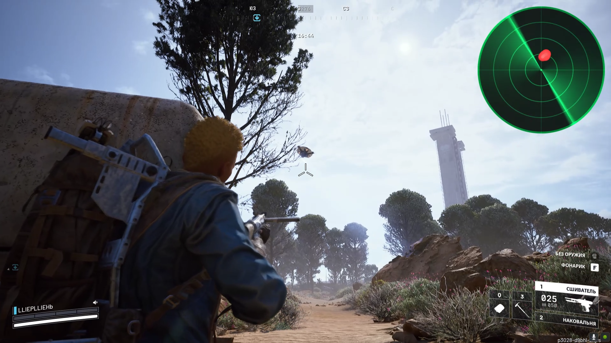

# Radar Audio Overlay

Real-time audio direction radar overlay with sonar-style visualization for Windows. This application helps people with hearing difficulties to visualize sound sources in real-time, making it easier to understand spatial audio information.

## ⚠️ Important Notice

**This is NOT a cheat or hack.** This application analyzes audio signals from your system to provide visual feedback. It is designed as an **accessibility tool** to help people with hearing difficulties better understand spatial audio information in games and applications.

## Features

- **Real-time audio direction visualization** - See where sounds are coming from
- **Multi-channel audio support** - Works with stereo, 5.1, and 7.1 audio systems
- **Multiple visualization modes** - Ping, Trail, Ripple, Line, Hex, Arc, Cone, Pulse
- **Metaball effects** - Organic merging of close sound sources
- **Customizable overlay** - Adjustable size, position, opacity, and transparency
- **Persistent settings** - Your preferences are saved automatically
- **Always-on-top transparent window** - Never blocks your view

## Screenshot



The radar overlay appears in the top-right corner, showing real-time sound direction visualization with a sonar-style display. The red dot indicates a detected sound source, while the green sweep line rotates to show the scanning pattern.

## Requirements

- **Windows 10/11** (64-bit)
- **Visual Studio 2022/2026** with C++20 support
- **DirectX 11** compatible graphics card
- **VB-Audio Virtual Cable** (see installation below)

## Installation

### Step 1: Install VB-Audio Virtual Cable

1. Download VB-Audio Virtual Cable from: https://vb-audio.com/Cable/
2. Extract the ZIP file
3. **Run the setup program as Administrator** (right-click → Run as administrator)
4. **Reboot your computer** after installation

### Step 2: Configure Windows Audio

1. Open **Windows Sound Settings** (right-click speaker icon → Sound settings)
2. Set **VB-Audio Virtual Cable** as your default playback device
3. Go to **Recording devices**
4. Find **CABLE Output (VB-Audio Virtual Cable)**
5. Right-click → **Properties** → **Listen** tab
6. Check **"Listen to this device"**
7. Select your actual speakers/headphones in the dropdown
8. Click **OK**

### Step 3: Build the Project

1. Clone this repository:
   ```bash
   git clone --recursive https://github.com/skynet174/radar-overlay.git
   cd radar-overlay
   ```

2. Generate Visual Studio solution:
   ```bash
   generate.bat
   ```

3. Open `radar.sln` in Visual Studio
4. Build the project (F7 or Build → Build Solution)
5. Run the application from `Bin/Release/radar.exe`

## Usage

1. Launch the application
2. The settings window will appear - configure your preferences
3. The radar overlay will appear on your screen
4. Click **"Audio Capture"** to start analyzing audio
5. Adjust size, position, and opacity as needed

### Controls

- **Position buttons** - Move radar to different screen edges
- **Hide Radar** - Toggle radar visibility
- **Degrees** - Show/hide degree labels
- **Size slider** - Adjust radar size
- **Opacity slider** - Adjust transparency
- **Echo modes** - Change visualization style
- **Sweep** - Toggle rotating sweep lines

## Project Structure

```
radar/
├── src/              # Source code
│   ├── main.cpp      # Application entry point
│   ├── Radar.cpp/h   # Radar rendering and visualization
│   ├── Interface.cpp/h # Settings UI window
│   ├── AudioCapture.cpp/h # Audio capture using miniaudio
│   └── Settings.cpp/h # Persistent settings management
├── vendor/           # Third-party libraries
│   └── miniaudio-0.11.23/ # Audio library (Git submodule)
├── Bin/              # Compiled executables
├── Build/             # Build intermediate files
└── premake5.lua       # Build configuration
```

## Pros and Cons

### ✅ Advantages

- **Accessibility focused** - Helps people with hearing difficulties
- **Real-time visualization** - Instant feedback on sound direction
- **Low overhead** - Minimal performance impact
- **Customizable** - Extensive configuration options
- **Open source** - Free to use and modify
- **No game modification** - Works with any application

### ❌ Limitations

- **Requires virtual audio cable** - Additional software setup needed
- **Windows only** - No Linux/macOS support
- **Audio analysis only** - Cannot enhance audio quality
- **Visual feedback only** - Does not replace hearing aids
- **Requires multi-channel audio** - Best results with 5.1/7.1 systems

## Technical Details

- **Rendering**: Direct3D 11 with HLSL shaders
- **Text rendering**: Direct2D/DirectWrite
- **Audio capture**: miniaudio library (WASAPI backend)
- **Window management**: Win32 API
- **Settings storage**: INI file format

## Building from Source

### Prerequisites

- Visual Studio 2022 or 2026
- Premake5 (included in `utils/` folder)
- Windows SDK 10.0 or later

### Build Steps

1. Run `generate.bat` to create Visual Studio solution
2. Open `radar.sln` in Visual Studio
3. Select **Release x64** configuration
4. Build solution (F7)

## Contributing

Contributions are welcome! Please feel free to submit a Pull Request.

## License

This project uses:
- **miniaudio** - Public domain / MIT No Attribution (see vendor/miniaudio-0.11.23/LICENSE)

## Acknowledgments

- [miniaudio](https://github.com/mackron/miniaudio) - Audio capture library
- [VB-Audio](https://vb-audio.com/Cable/) - Virtual Audio Cable
- [Premake](https://premake.github.io/) - Build system generator

## Support

For issues, questions, or suggestions, please open an issue on GitHub.

---

**Remember**: This tool is designed to help people with hearing difficulties visualize audio information. It is not intended for cheating or gaining unfair advantages in games.

